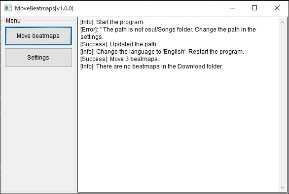

# MoveBeatmaps
Osu!の譜面ファイルをSongsフォルダに一括移動する。

MoveBeatmaps is a tool that moves all beatmaps from the Download folder to the osu!/Songs folder.

## Download
ダウンロードは[こちら](https://github.com/KerorinNorthFox/Move_Osu_Beatmaps/releases/latest/download/MoveBeatmaps-v1.1.0-release.zip)を押すとダウンロードが開始されます。

## Usage
使い方は同梱のreadme_(lang).txtに書いてあります。

## Required
OS: Windows only

## TODO
- [x] Move beatmaps.
- [x] Japanese/English mode.
- [x] Get notified of updates when app is launched.
- [ ] Unpack skins.
- [ ] Move selected beatmaps.

## History
### 22/2/25: 
リリース

### 22/2/26:
譜面ファイル移動時にプロンプトが点滅するバグを修正
更新通知をアプリ内で受け取れる機能を実装

